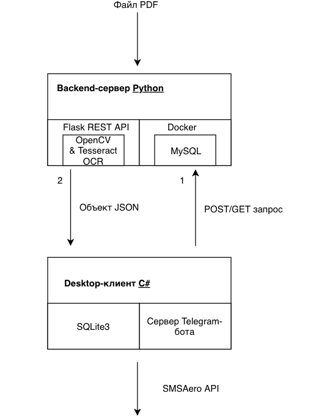
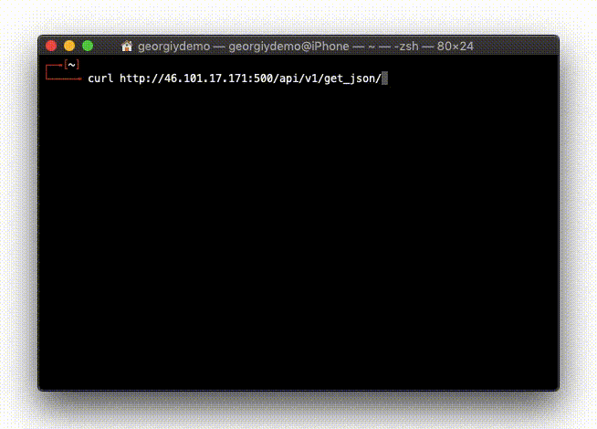

## Курсовая работа «ПО для рассылки расписания студентам колледжа с использованием технологий OpenCV и Tesseract OCR»

### Архитектура решения

  

### Визуализация работы решения
Пример работы парсинга OpenCV & распознавание с помощью Tesseract OCR:

  
  

Пример работы использования Flask REST API:

  

### Зависимости решения

Фронт [C#]:
* [Telegram.Bot](https://github.com/TelegramBots/Telegram.Bot)
* [SQLite](https://www.sqlite.org/)
* [Microsoft.Data.Sqlite](https://github.com/aspnet/Microsoft.Data.Sqlite)
* [Newtonsoft.Json](https://github.com/JamesNK/Newtonsoft.Json)
* [MySQLConnector](https://github.com/mysql-net/MySqlConnector)
* [HttpToSocks5Proxy](https://github.com/MihaZupan/HttpToSocks5Proxy)
* [HandyControl](https://github.com/NaBian/HandyControl)
* [SMSAero API Class](https://smsaero.ru/classes/class-Csharp-v2/)

Бэкенд [Python]:
* [Flask REST API](https://github.com/pallets/flask)
* [OpenCV](https://github.com/opencv/opencv)
* [Tesseract OCR](https://github.com/tesseract-ocr/tesseract)
* [Pdf2image](https://github.com/Belval/pdf2image)
* [DANTED SOCKS5 Proxy](https://github.com/Lozy/danted)
* [Docker MySQL server](https://github.com/docker-library/mysql)
* [GNU Screen](https://www.gnu.org/software/screen/)
