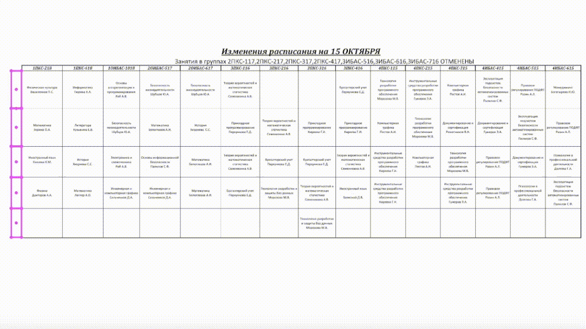

### Взял мой .docx за основу — штраф звездочка ( ͡° ͜ʖ ͡°)

### Курсовой «ПО по рассылке расписания занятий студентам по SMS на языке С#»

Фронт библиотеки:
* [MySQLConnector](https://github.com/mysql-net/MySqlConnector)
* [HttpToSocks5Proxy](https://github.com/MihaZupan/HttpToSocks5Proxy)
* [Telegram.Bot](https://github.com/TelegramBots/Telegram.Bot)

Бэкенд:
* [Docker MySQL server](https://github.com/docker-library/mysql)
* [Danted Socks5 proxy](https://github.com/Lozy/danted)

